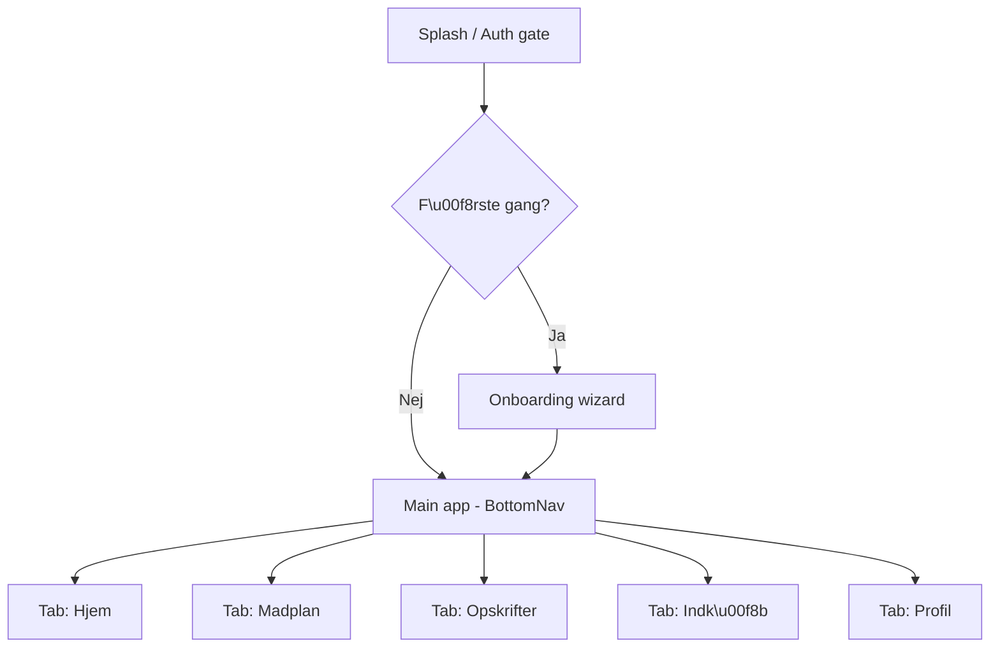
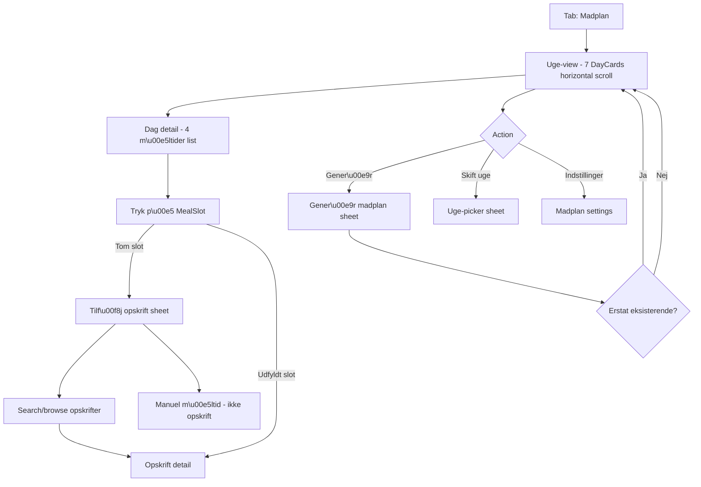
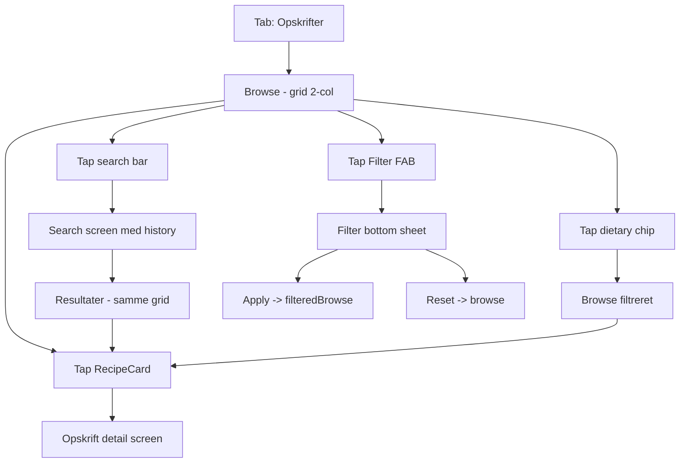
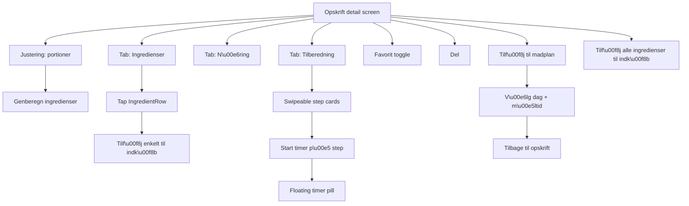

# Sitemap — Madplan + Opskrifter

Første prioritet i Figma-designet. Kernen i app-oplevelsen.

## Overordnet app-navigation

## Madplan-flow

## Opskrifter-flow

## Opskrift detail-flow

Hjertet i appen. Her bruger brugeren mest tid.

## Skærme der skal designes (i rækkefølge)

Når du har lavet atoms og molecules, designer du disse skærme i denne rækkefølge:

1. **RecipeBrowseScreen** — det første en bruger ser når de tapper Opskrifter-tab
2. **RecipeDetailScreen** — vigtigste skærm, definerer det visuelle sprog
3. **RecipeDetailScreen / Steps tab** — swipeable step cards (designvalg her sætter standarden)
4. **RecipeFilterSheet** — bottom sheet med dietary chips, time, servings
5. **MealPlanWeekScreen** — uge-view med horizontal day cards
6. **MealPlanDayScreen / detail** — 4 meal slots + dagens næring
7. **AddRecipeToMealPlanSheet** — vælg dag + måltid
8. **ShoppingListScreen** — grouped by kategori, swipe-to-delete
9. **ServingsAdjustSheet** — stepper med live-genberegning
10. **ActiveTimerPill** — floating bottom-anchored timer
11. **EmptyState varianter** — én for tomme madplaner, tomme indkøbslister, ingen søgeresultater

## Eksplicit IKKE i første runde

- Profil / settings (kommer i fase 2)
- Onboarding wizard (kommer i fase 2)
- Hjem-tab (defineres senere — er det dashboard? Quick-actions? Feed?)
- Vægttracker / kalorietælling (separate flows, fase 3)
- Push notifications design
- Dark mode
- Tablet-layouts

## Vigtige designvalg du møder undervejs

Skriv din løsning ned i Figma-filens "02 — Changelog"-side når du træffer disse beslutninger:

1. **Step-by-step layout**: Horizontal swipeable cards (anbefalet — føles app-native) eller scroll-down list?
2. **Ingredient tap-action**: Direkte tilføj til indkøb, eller åbn detail sheet med substitutter?
3. **Servings adjuster placement**: Inline øverst i ingredients-tab eller sticky bottom-anchored?
4. **Timer behaviour**: Floating pill der følger bruger på tværs af skærme, eller modal der låser brugeren til opskriften?
5. **Day-view i madplan**: Vertikal list (4 meals stacked) eller horizontal pager (swipe mellem måltider)?
6. **Filter sheet height**: Compact (40%), half (50%) eller large (80%)?
