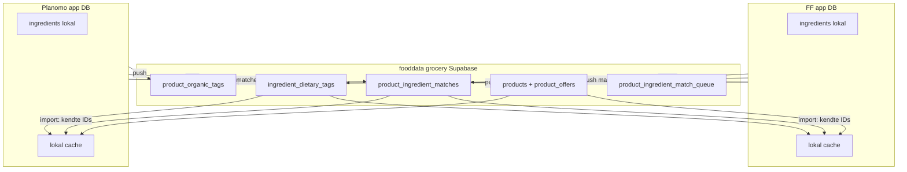

# Handoff til FunctionalFoods: Fælles kuratering i fooddata

**Målgruppe:** FF Cursor  
**Formål:** Fooddata er **fælles kurateringslag** for matches og tags — ikke Planomo-only. Begge apps skriver (union merge) og læser (filtreret lokalt). **Ingrediens-kataloger forbliver lokale**; kun overlappende `ingredient_id` UUID'er deles.

**Relateret:**
- [FF_HANDOFF_FOODDATA_INGREDIENT_MATCHING.md](./FF_HANDOFF_FOODDATA_INGREDIENT_MATCHING.md) — match-workflows
- [FF_HANDOFF_TILBUD_BILKA_NETTO_REMA.md](./FF_HANDOFF_TILBUD_BILKA_NETTO_REMA.md) — katalog/tilbud
- [FF_HANDOFF_MADBUDGET_WIZARD.md](./FF_HANDOFF_MADBUDGET_WIZARD.md) — madbudget bruger matches

---

## TL;DR

| Lag | Delt? | Hvem skriver |
|-----|-------|--------------|
| `products`, `product_offers`, `stores` | Ja | FF (scrape/sync) |
| `product_ingredient_matches` | Ja (union) | Planomo **og** FF |
| `ingredient_dietary_tags` | Ja (per `ingredient_id`) | Planomo **og** FF |
| `product_organic_tags` | Ja | Planomo **og** FF |
| `product_ingredient_match_queue` | Ja | Planomo **og** FF |
| Hele `ingredients`-tabellen | **Nej** — lokalt | Hver app |

**Ingrediens-UUID:** Core-ingredienser (agurk, tomat, mælk, …) skal have **samme UUID** i begge apps. App-specifikke ingredienser er OK — den anden app ignorerer ukendte IDs ved import.

**Produktnøgle:** `product_external_id` = `{source_chain}-{source_id}` (fx `bilka-110606`).

---

## 1. Arkitektur



---

## 2. Fooddata-tabeller (FF skal oprette)

SQL i rækkefølge:

1. [`scripts/fooddata-schema/001_planomo_publish_tables.sql`](../scripts/fooddata-schema/001_planomo_publish_tables.sql)
2. [`scripts/fooddata-schema/002_shared_curation_source.sql`](../scripts/fooddata-schema/002_shared_curation_source.sql)
3. [`scripts/fooddata-schema/003_ingredient_id_text.sql`](../scripts/fooddata-schema/003_ingredient_id_text.sql) — **kræves** for `ingredient-*` ids (agurk, mælk, …)

| Tabel | Nøgle | `source` |
|-------|-------|----------|
| `product_ingredient_matches` | `(product_external_id, ingredient_id)` | `planomo` \| `ff` |
| `product_ingredient_match_queue` | `product_id` (UNIQUE) | `planomo` \| `ff` |
| `ingredient_dietary_tags` | `ingredient_id` | `planomo` \| `ff` |
| `product_organic_tags` | `product_external_id` | `planomo` \| `ff` |

---

## 3. Merge-regler (vigtigt)

| Operation | Regel |
|-----------|-------|
| **Upsert match** | Union — `(product_external_id, ingredient_id)` er unik nøgle; begge apps kan tilføje |
| **Delete match** | Kun rækker med `source = egen_app` — aldrig slet den anden apps rækker |
| **Tags** | Last-write-wins per `ingredient_id` i fooddata; ved pull merges tag-arrays lokalt |
| **Queue bulk sync** | Kun `status = 'pending'` som standard (undgå 60k+ historik) |
| **Import pull** | Filtrér: `ingredient_id IN (local ingredients)` og `product_external_id IN (local products)` |

---

## 4. Planomo scripts

```bash
# Verificér core-ingrediens UUID overlap (kræver FF creds for fuld check)
npm run fooddata:verify-uuid

# Push Planomo → fooddata (sikre defaults: pending queue, resolved matches)
npm run fooddata:sync-publish:dry-run
npm run fooddata:sync-publish

# Pull fooddata → Planomo (FF's kurering)
npm run fooddata:pull-curation

# Første sikre merge (dry-run → --execute når FF SQL er kørt)
npm run fooddata:initial-merge
npm run fooddata:initial-merge:execute

# Import katalog + valgfri pull
npx tsx scripts/import-fooddata-to-planomo.ts --pull-curation
npx tsx scripts/import-fooddata-to-planomo.ts --curation-only
```

**Push flags:**

```bash
npx tsx scripts/sync-planomo-to-fooddata.ts --queue=pending      # default
npx tsx scripts/sync-planomo-to-fooddata.ts --matches=resolved-only
npx tsx scripts/sync-planomo-to-fooddata.ts --only=matches,tags
```

**Env (Planomo):** `GROCERY_SUPABASE_URL` + `GROCERY_SUPABASE_SECRET_KEY`

---

## 5. FF: implementér samme mønster (mirror)

FF skal spejle Planomos publish/import-lib — ikke opfinde parallel logik i main DB.

### 5.1 Publish (FF → fooddata)

Kopiér mønster fra Planomo `src/lib/fooddata-publish/`:

| Modul | Ansvar |
|-------|--------|
| `config.ts` | `FOODDATA_PUBLISH_SOURCE = 'ff'` |
| `matches.ts` | Union upsert; delete kun `source = 'ff'` |
| `queue.ts` | Upsert kø; `filterQueueForPublish('pending')` ved bulk |
| `ingredient-tags.ts` | Upsert `ingredient_dietary_tags` med `source = 'ff'` |
| `product-organic-tags.ts` | Upsert `product_organic_tags` |

**Push on save** (som Planomo admin):

- Når FF admin opretter/sletter match → upsert/delete i fooddata
- Når FF gemmer fravalg-tags → upsert `ingredient_dietary_tags`
- Når FF kører øko-scan → upsert `product_organic_tags`

**Bulk reconcile:**

```bash
# FF tilsvarende script (implementér i FF-repo)
npx tsx scripts/sync-ff-to-fooddata.ts --queue=pending --matches=resolved-only
```

### 5.2 Import pull (fooddata → FF lokal cache)

Spejl `src/lib/fooddata-import/curation-pull.ts`:

```typescript
// Pseudokode — filtrér altid lokalt
const localIngredientIds = await loadIds('ingredients')
const localProductIds = await loadIds('products')

for (const match of fooddataMatches) {
  if (!localIngredientIds.has(match.ingredient_id)) continue
  if (!localProductIds.has(match.product_external_id)) continue
  await upsertLocalMatch(match)
}
```

**SQL til madbudget:**

```sql
SELECT m.*
FROM product_ingredient_matches m
WHERE m.ingredient_id = ANY($1::uuid[])  -- kun FF's lokale ingredient IDs
  AND m.product_external_id = ANY($2::text[]);  -- kun FF's lokale product IDs
```

Alternativt: importér til lokal `product_ingredient_matches`-cache og brug som i dag.

### 5.3 FF env

```bash
GROCERY_SUPABASE_URL=          # fooddata (samme som Planomo)
GROCERY_SUPABASE_SECRET_KEY=   # service role
```

### 5.4 FF fil-struktur (forslag)

```
src/lib/fooddata-publish/     # push til fooddata (source = 'ff')
src/lib/fooddata-import/      # pull fra fooddata (filtrér lokalt)
scripts/sync-ff-to-fooddata.ts
scripts/sync-fooddata-curation-to-ff.ts
scripts/verify-ingredient-uuid-overlap.ts  # samme som Planomo
```

---

## 6. Hvornår Planomo pusher (allerede bygget)

| Hændelse | Fooddata tabel |
|----------|----------------|
| Admin opretter match | `product_ingredient_matches` upsert (`source=planomo`) |
| Admin sletter match | delete kun `source=planomo` |
| Kø: match / dismiss | queue upsert |
| Nye varer enqueued | queue upsert |
| Fravalg-tags gemt | `ingredient_dietary_tags` upsert |
| Øko-scan | `product_organic_tags` upsert |
| Bulk reconcile | `scripts/sync-planomo-to-fooddata.ts` |

Planomo gemmer **altid lokalt først**. Fooddata-push er best-effort.

---

## 7. Datamodel-detaljer

### `product_external_id`

```
{source_chain}-{source_id}
```

Eksempler: `bilka-110606`, `rema-1000-306872`, `netto-78443601-EA`

### Fravalg vs. øko

| Lag | Hvor (fooddata) | Bruges til |
|-----|-----------------|------------|
| Ingrediens fravalg | `ingredient_dietary_tags.food_exclusions` | Opskriftvalg / madplan |
| Produkt øko | `product_organic_tags.organic_tags` | Prioriter øko-varer i prissøgning |

### Ingrediens-katalog

**Synkroniser IKKE hele `ingredients` mellem apps.** Verificér kun at overlappende navne deler UUID:

```bash
npm run fooddata:verify-uuid
# FF: sæt FF_SUPABASE_URL + FF_SUPABASE_SERVICE_ROLE_KEY i .env.local
```

---

## 8. FF tjekliste

- [ ] Kør `001` + `002` + `003` SQL i grocery Supabase
- [ ] Verificér core `ingredient_id` UUID overlap med Planomo
- [ ] Implementér `fooddata-publish/` med `source = 'ff'`
- [ ] Implementér pull/import med lokal ID-filtrering
- [ ] Push on save fra FF admin
- [ ] Bulk sync med `--queue=pending` og `--matches=resolved-only`
- [ ] Læs matches fra fooddata (ikke Planomo DB, ikke Goma)
- [ ] Kør **ikke** blind one-way push af hele kø-historik

---

## 9. Planomo kode-reference

| Modul | Fil |
|-------|-----|
| Publish-lib | `src/lib/fooddata-publish/` |
| Import pull | `src/lib/fooddata-import/curation-pull.ts` |
| Push bulk | `scripts/sync-planomo-to-fooddata.ts` |
| Pull bulk | `scripts/sync-fooddata-curation-to-planomo.ts` |
| Initial merge | `scripts/initial-fooddata-curation-merge.ts` |
| UUID verify | `scripts/verify-ingredient-uuid-overlap.ts` |
| Fooddata schema | `scripts/fooddata-schema/` |

---

## 10. One-liner til FF

> Fooddata er fælles kurering for matches og tags. I scraper katalog/tilbud; begge apps pusher matches/tags med `source=ff|planomo` og importerer kun rækker med kendte `ingredient_id`/`product_external_id`. Ingrediens-kataloger forbliver lokale — kun core UUID overlap er kritisk.
